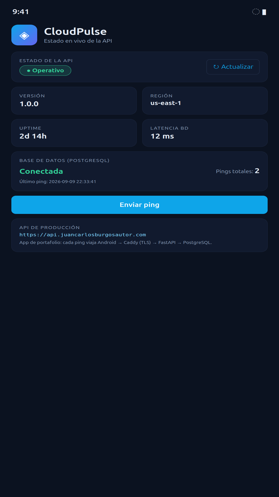
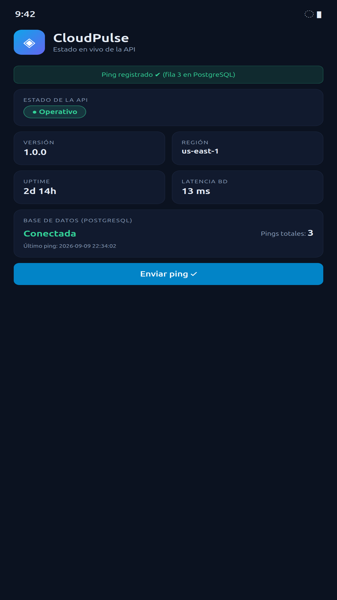
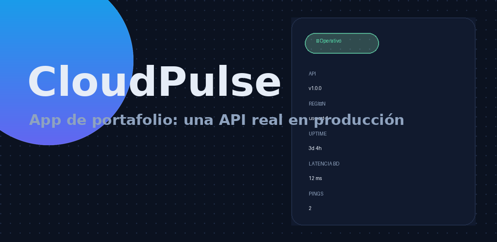
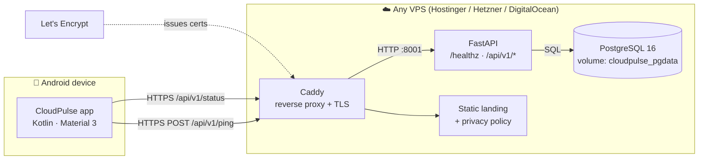

# CloudPulse

> **A deliberately small Android app that consumes a real, production-grade cloud backend.**
> Built as a portfolio piece to explain — component by component — how a service is designed, deployed,
> observed, secured and migrated between cloud providers.

[](../../actions/workflows/ci.yml)
[](LICENSE)
[](https://api.juancarlosburgosautor.com/healthz)
[](https://play.google.com/apps/internaltest/4701233828689047702)
[-3DDC84?logo=android&logoColor=white)](android/)
[](android/)
[](backend/)
[](backend/)
[](deploy/)

---

## What it is (and what it deliberately is not)

CloudPulse shows, on a phone, the **live health of its own backend**: API status, database connectivity and
latency, version, region, uptime, and a **ping** button that writes a real row into PostgreSQL and reports the
running total (proving the read *and* write path end-to-end).

It is **not** a product. It is an **architecture demonstrator**: every layer is real, deployed, monitored and
replaceable, and the whole thing is small enough to be explained in a 10-minute interview.

| Layer | Technology | Where it runs | Why it exists |
|---|---|---|---|
| Client | Android (Kotlin, Material 3, OkHttp, coroutines) | User's device | Real mobile client with error/offline handling and auto-refresh |
| Edge | Caddy 2 (reverse proxy + automatic TLS) | VPS, container | TLS termination, Let's Encrypt automation, static site |
| API | Python 3.12 + FastAPI + Uvicorn | VPS, container | Stateless REST API, OpenAPI docs, health endpoint |
| Data | PostgreSQL 16 + named volume + healthcheck | VPS, container | Durable state, proves writes are real |
| Web | Static landing + privacy policy | VPS, Caddy | Store-listing requirement + human-readable live status |

<p align="center">
  
  
</p>

<p align="center"></p>

---

## Architecture



Full rationale, data flows, failure modes and trade-offs: **[docs/ARCHITECTURE.md](docs/ARCHITECTURE.md)**.
Decisions are recorded as ADRs in **[docs/ADR/](docs/ADR/)** (the *why*, not just the *what*).

---

## Live demo

| Resource | URL |
|---|---|
| Health check | https://api.juancarlosburgosautor.com/healthz |
| Full status (used by the app) | https://api.juancarlosburgosautor.com/api/v1/status |
| OpenAPI / Swagger | https://api.juancarlosburgosautor.com/docs |
| Landing + privacy policy | https://cloudpulse.juancarlosburgosautor.com |
| App (Google Play, internal testing) | https://play.google.com/apps/internaltest/4701233828689047702 |

```bash
curl -s https://api.juancarlosburgosautor.com/healthz
# {"status":"ok","db":"up","version":"1.0.0","uptime_s":5187}

curl -s -X POST https://api.juancarlosburgosautor.com/api/v1/ping
# {"ok":true,"ping_id":"597c24c2","db_row_id":10,"total_pings":10,"region":"us-east-1", ...}
```

---

## Quickstart

### Backend + database (any machine with Docker)

```bash
git clone https://github.com/juancburgos/cloudpulse.git && cd cloudpulse
cp .env.example .env          # set DB_PASSWORD and REGION
make up                       # docker compose up -d --build
make smoke                    # curl the health endpoint
```

API on `http://127.0.0.1:8001` (bound to localhost on purpose — the proxy is what faces the internet).

### Edge proxy (TLS)

```bash
sudo cp deploy/Caddyfile.example /etc/caddy/Caddyfile   # edit your domain
sudo systemctl reload caddy
```

### Android app

```bash
cd android
./gradlew assembleDebug      # requires JDK 17 + Android SDK 36
# point the API host at your deployment:
./gradlew assembleRelease -PapiUrl=https://api.your-domain.tld
```

---

## Production checklist (what "done" means here)

- [x] TLS everywhere, certificates renewed automatically
- [x] Database not exposed publicly; only the proxy is
- [x] Container healthchecks + restart policy
- [x] Stateless API (scales horizontally by construction)
- [x] Structured health/status endpoint consumed by the client
- [x] Zero secrets in the repository (`.env`, keystores and tokens are git-ignored)
- [x] Cloud-portable: no provider-specific primitives, migration documented and timed
- [x] Privacy: no accounts, no ads, no analytics, no personal data collected
- [x] Documented runbook for deploy, rollback, backup and incident response

---

## Repository layout

```
.
├── android/            # Kotlin app (single Activity, Material 3, OkHttp, coroutines)
├── backend/            # FastAPI service + Dockerfile + pytest suite
├── deploy/             # docker-compose.yml, Caddyfile example, deployment notes
├── web/                # Static landing + privacy policy served by Caddy
├── docs/               # Architecture, ADRs, runbook, API, roadmap, senior review
├── scripts/            # smoke test, DB backup, deploy helper
├── screenshots/        # Store assets / visual documentation
└── .github/            # CI workflow, issue & PR templates
```

---

## Engineering notes

- **Health vs. status:** `/healthz` is dependency-light and safe for load balancers and uptime monitors;
  `/api/v1/status` is the richer payload the app renders. Separating them avoids turning a monitoring probe
  into a database benchmark.
- **Failure is a feature:** the client renders an explicit degraded/offline state, so the "sad path" can be
  demonstrated in an interview by stopping a container.
- **Portability was designed in, not retrofitted:** nothing in the stack is vendor-specific. Migrating from
  one VPS provider to another is DNS + `docker compose up` (see `docs/RUNBOOK.md#migration`).
- **Right-sizing:** 2 vCPU / 4 GB is enough for this workload; the compose file pins the API to localhost so
  the security boundary is explicit.

---

## Documentation map

| Document | Contents |
|---|---|
| [docs/ARCHITECTURE.md](docs/ARCHITECTURE.md) | Components, data flow, failure modes, scaling path |
| [docs/ADR/](docs/ADR/) | Architecture Decision Records (context → decision → consequences) |
| [docs/RUNBOOK.md](docs/RUNBOOK.md) | Deploy, rollback, backup/restore, incident, cloud migration |
| [docs/API.md](docs/API.md) | Endpoint contract, examples, error semantics |
| [docs/ROADMAP.md](docs/ROADMAP.md) | What a v2 would add (and what it deliberately won't) |
| [docs/SENIOR-REVIEW.md](docs/SENIOR-REVIEW.md) | How a senior architect reviews this repo (rubric + self-assessment) |
| [CONTRIBUTING.md](CONTRIBUTING.md) · [SECURITY.md](SECURITY.md) · [CHANGELOG.md](CHANGELOG.md) | Contribution flow, vulnerability reporting, version history |

---

## License

MIT — see [LICENSE](LICENSE). Free to read, fork and learn from.
