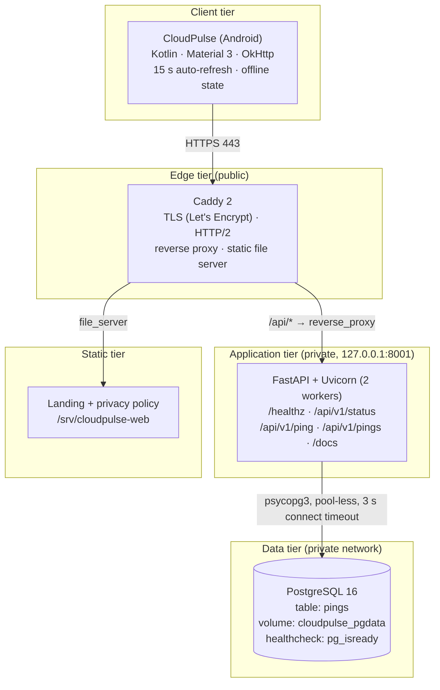
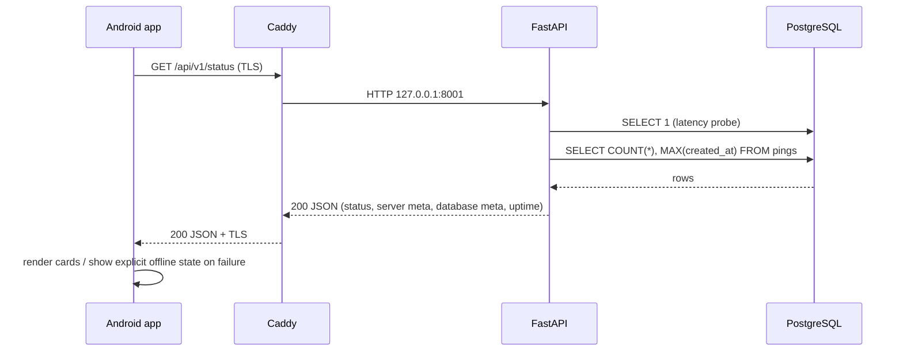
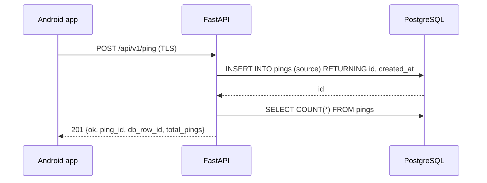

# Architecture — CloudPulse

## 1. Context

CloudPulse exists to demonstrate, in a system small enough to reason about completely, how a cloud service is
**designed, deployed, observed, secured and migrated**. The functional requirement is trivial on purpose:

> Show the live health of a backend on a phone, and let the user prove persistence with a single write.

Everything else in this document is about the qualities around that requirement: availability of the read path
when dependencies fail, clarity of the contract, operational cost, and portability between providers.

## 2. Component view

### Why each boundary exists

| Boundary | Reason |
|---|---|
| Device → Edge (public) | Only one component is public. TLS is terminated once, in one place. |
| Edge → App (localhost) | The API has no public DNS record and publishes port `8001` on `127.0.0.1` only. A compromised container cannot be reached directly from the internet. |
| App → Data (compose network) | PostgreSQL has no published port at all; it is reachable only by the API container on the internal Docker network. |
| Edge → Static | The privacy policy required by the app store is served by the same trusted ingress, no extra service. |

## 3. Request flows

### 3.1 Read path (status refresh, every 15 s while the app is foregrounded)

### 3.2 Write path (the "ping" button)

The response deliberately returns **both** the new row id and the new total, so a single round trip proves the
write *and* the aggregate read.

## 4. Failure modes (and the designed answer)

| Failure | System behaviour | How to demo it live |
|---|---|---|
| PostgreSQL down | `/healthz` → `{"status":"degraded","db":"down"}`; `/api/v1/status` → `degraded`, null aggregates; writes return 500 with a JSON error; the app shows "Sin conexión" and keeps the last good values | `docker stop cloudpulse-db`, refresh the app |
| API down | Caddy returns `502`; the app shows the offline state and retries on the next 15 s tick | `docker stop cloudpulse-api` |
| Certificate renewal failure | Caddy keeps serving the existing cert and retries; the failure is visible in the proxy logs | `docker logs caddy-caddy-1` |
| Client offline / airplane mode | Immediate, explicit offline UI; no crash, no infinite spinner | Enable airplane mode |
| Slow database | `connect_timeout=3 s` bounds the probe; the request fails fast instead of hanging a worker | Add latency with `tc` (see RUNBOOK) |
| Bad/missing JSON field | The client renders `—` for the missing value instead of crashing | Inspect `renderStatus` in `MainActivity.kt` |

## 5. Non-functional targets

| Quality | Target | How it is met |
|---|---|---|
| Availability | Read path degrades instead of failing | Health probes separated; aggregates tolerate a dead DB |
| Latency | Status < 300 ms p95 on this hardware | Indexed count, single small table, 2 Uvicorn workers |
| Recovery | Restart-safe | `restart: unless-stopped` on every container, named volume for data |
| Security | No unauthenticated administrative surface | DB unpublished, API on loopback, TLS everywhere |
| Cost | ≤ US$6/month | One small VPS; no managed services, no load balancer, no NAT gateway |
| Portability | Provider migration in < 30 minutes | Docker Compose + DNS only; documented and timed |
| Privacy | Zero personal data | No accounts, no ads, no analytics; technical metadata only |

## 6. Scaling path (what changes at 100× and why not before)

1. **Horizontal API scale** — the service is stateless: run N replicas behind the proxy. *(No code change.)*
2. **Managed database** — move PostgreSQL to a managed instance with automated backups and a read replica.
3. **Cache the read path** — the status payload is identical for every client; a 5 s cache removes almost all
   database load.
4. **Queue the writes** — a bounded queue absorbs write bursts if ping volume becomes continuous rather than
   user-driven.
5. **Observability before more architecture** — metrics (request rate, error rate, DB latency), structured
   logs and alerting come *before* adding components, because unobservable scale is just slower failure.

What would justify Kubernetes here: multiple teams deploying independently, per-PR preview environments, or
compliance isolation requirements. None of those exist at this size — see ADR-0003.

## 7. Threat model (short)

| Threat | Mitigation |
|---|---|
| Public database scan/brute force | No published port; strong password via environment; internal Docker network only |
| Secret leakage via git | `.env`, keystores and tokens are git-ignored; `.env.example` documents the shape, never the value |
| Abuse of the write endpoint | Public by design (no auth for the demo); rate limiting is the first roadmap item if abuse appears |
| MITM on the client | TLS with publicly trusted certificates; no cleartext fallback in the app |
| Container escape | Containers run the distribution default; non-root user and read-only root filesystem are roadmap items |

## 8. Environments

| Environment | Purpose | Notes |
|---|---|---|
| Local (`docker compose up`) | Development and demos | Same images as production; no TLS (loopback) |
| Production VPS | The live app and its Play Store build | Caddy terminates TLS; deployed from this repository |

There is deliberately no staging environment at this size: the deployment is a single reproducible compose
file, and rollback is `docker compose up -d` with a previous image tag (see RUNBOOK).
